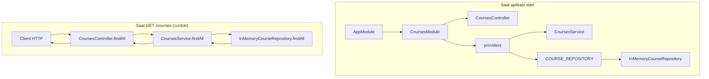
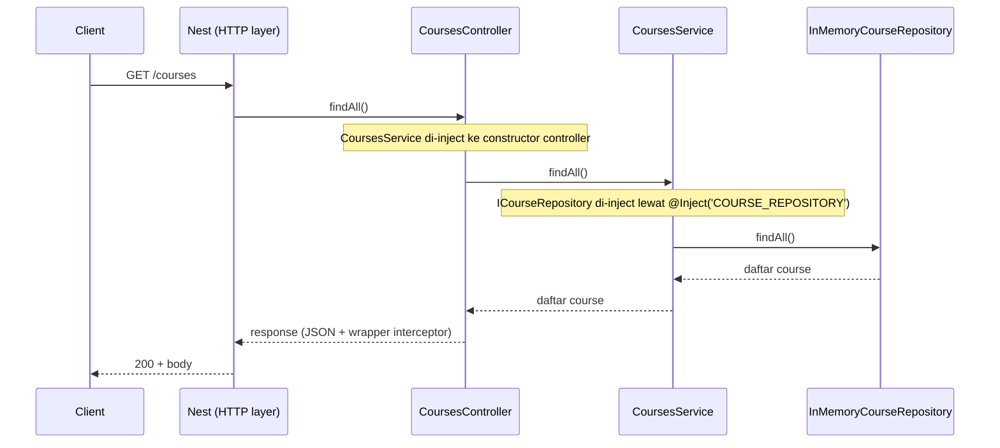

# Step 09 – Dependency Injection (DI) di NestJS

## 1. Tujuan Belajar

Setelah menyelesaikan step ini kamu diharapkan:

- **Memahami** apa itu Dependency Injection dan kenapa dipakai di NestJS.
- **Menjelaskan** perbedaan antara “membuat dependency sendiri” vs “menerima dependency dari framework”.
- **Mengenal** konsep provider, token injeksi, dan constructor injection.
- **Mampu menerapkan** pola DI yang sudah kita pakai di project (misalnya repository lewat token).
- **Menilai** kapan DI membantu dan kapan bisa berlebihan (trade-off).

---

## 2. Apa itu Dependency Injection (DI)?

**Dependency** = sesuatu yang dibutuhkan sebuah class agar bisa bekerja (service lain, repository, HTTP client, dsb.).

**Injection** = dependency tersebut **tidak dibuat manual di dalam class** (misalnya `new SomeService()`), melainkan **diberikan dari luar** (biasanya oleh container/framework).

Contoh pola tanpa DI (manual):

```typescript
class CoursesService {
  private repo = new InMemoryCourseRepository(); // kuat terikat ke implementasi konkret
}
```

Contoh dengan DI (Nest):

```typescript
@Injectable()
export class CoursesService {
  constructor(
    @Inject('COURSE_REPOSITORY')
    private readonly coursesRepository: ICourseRepository,
  ) {}
}
```

Class `CoursesService` **tidak memutuskan** implementasi konkret repository-nya; Nest yang menyediakan instance yang sesuai saat aplikasi jalan.

### 2.1. Inversion of Control (IoC) — fondasi DI

Tanpa framework, biasanya **class pemanggil** yang memutuskan “aku akan `new` siapa”:

```typescript
const repo = new PostgresCourseRepository(/* connection string hard-coded */);
const service = new CoursesService(repo);
```

Dengan **IoC (Inversion of Control)**, urutan keputusan dibalik:

- Bukan class bisnis yang “menciptakan” semua dependency-nya.
- Ada **container** (di Nest: IoC container) yang tahu:
  - class apa saja ada,
  - siapa butuh siapa,
  - implementasi mana yang dipakai di environment ini.

**Dependency Injection** adalah salah satu cara paling umum untuk mewujudkan IoC: dependency **disuntikkan** lewat constructor / factory, bukan dibuat sembarangan di dalam class.

### 2.2. Pola tanpa DI: gejala yang sering muncul di project

Kalau banyak `new KonkretClass()` di dalam service:

| Gejala | Kenapa menyusahkan |
|--------|--------------------|
| **Kuat terikat (tight coupling)** | Ubah DB / vendor API → harus usik banyak file. |
| **Sulit di-test** | Test ikut nyalakan DB jaringan nyata atau mock global “nakal”. |
| **Konfigurasi menyebar** | Connection string, API key, flag feature tersebar di banyak class. |
| **Duplikasi pembuatan objek** | Beberapa modul bikin instance client HTTP yang sama-sama butuh retry/timeout beda-beda. |

DI tidak otomatis menghilangkan semua masalah di atas, tapi **memberi satu jalur standar** untuk menghindari “new di mana-mana”.

### 2.3. Diagram alur: dari HTTP sampai repository

Di bawah ini **gambaran alur** untuk endpoint courses di project ini: siapa memanggil siapa, dan di mana Nest **menyuntikkan** dependency.

**A. Wiring di composition root (`CoursesModule`) vs alur saat request jalan**



**Inti yang perlu diingat:**

- **Module** = tempat **mendaftarkan** controller, service, dan binding `COURSE_REPOSITORY` → `InMemoryCourseRepository`.
- **Controller** tidak `new CoursesService()`; Nest sudah punya instance singleton (default) dari container.
- **Service** tidak `new InMemoryCourseRepository()`; Nest mengisi field repository lewat constructor + token.

**B. Urutan pesan (sequence diagram) — satu request**



Diagram di atas **disederhanakan**: middleware, pipe, interceptor, dan filter global tidak digambar supaya fokus ke rantai **controller → service → repository**.

---

## 3. Kenapa kita butuh DI?

### 3.1. Pemisahan tanggung jawab (Separation of concerns)

Service fokus ke **aturan bisnis** (create course, validasi bisnis), bukan ke detail “data disimpan di mana”.

### 3.2. Mudah diganti (Swappable implementation)

Hari ini repository in-memory; besok Prisma. Dengan DI:

- Kamu cukup **ganti provider** di module (`useClass: PrismaCourseRepository`).
- `CoursesService` bisa **tidak berubah** selama kontrak `ICourseRepository` sama.

### 3.3. Lebih mudah di-test

Di unit test, kamu bisa inject **fake repository** tanpa database atau tanpa in-memory global.

### 3.4. Satu tempat untuk “wiring”

Nest punya **IoC container**: daftar provider, siapa bergantung pada siapa, dan siklus hidup instance-nya.

### 3.5. Skenario konkret (mini cerita di codebase)

- **Lokal vs CI**: di lokal developer pakai in-memory agar cepat; di staging pakai Postgres. Tanpa DI, sering ada `if (env === 'test')` berserakan di service.
- **Vendor berubah**: tim memutuskan ganti payment dari A ke B. Kalau service cuma bergantung pada interface `PaymentGateway`, implementasi B bisa di-bind di module tanpa mengubah puluhan controller.

---

## 3A. Use case nyata di industri & project besar

Bagian ini menjawab: *“DI itu keren di slide, tapi dipakai buat apa di kerjaan nyata?”*

### 3A.1. Ganti implementasi tanpa mengubah business logic

**Contoh industri:**

- **Pembayaran**: Stripe, Midtrans, Xendit — interface sama (`charge`, `refund`), implementasi beda.
- **Email**: SendGrid, Mailgun, Amazon SES, atau `NoopEmailService` di development yang tidak benar-benar mengirim email.
- **Penyimpanan file**: upload ke S3 / GCS / lokal disk — service domain cuma tahu “simpan dan dapat URL”.

**Proyek internal:**

- **Feature flag**: implementasi `IFeatureToggle` — REST remote vs always-on di dev.
- **Antrian pesan**: RabbitMQ vs Redis vs in-memory queue untuk test.

DI membuat **batas (boundary)** jelas: logika domain tidak perlu tahu detail HTTP/SDK vendor.

### 3A.2. Environment & konfigurasi (dev / staging / production)

Di industri, **satu codebase** di-deploy ke banyak environment. DI + provider (sering `useFactory`) membantu:

- Membaca secret dari env / vault sekali,
- Menyuntikkan `DatabaseClient`, `Logger`, `HttpClient` yang sudah dikonfigurasi,
- Menghindari service yang membaca `process.env` di setiap method.

### 3A.3. Tim besar & modular architecture

- Satu tim mengerjakan modul `Billing`, tim lain `Courses`. DI + module membuat **batas dependensi** antar fitur lebih jelas: tidak import “sembarangan” ke internal class orang lain.
- **Onboarding developer baru**: pola “constructor isi dependency” konsisten di seluruh repo Nest.

### 3A.4. Testing & quality assurance

- **Unit test** cepat: mock payment, mock email, tanpa jaringan.
- **Contract test** / integration test: bind implementasi “nyata” tapi ke DB/container terisolasi.
- CI/CD: sering ada profil `test` yang mengikat `useValue` ke stub — itu semua natural dengan DI.

### 3A.5. Legacy & refactor bertahap

Banyak perusahaan punya modul lama. Pola umum:

- Bungkus akses legacy di satu **adapter** (`LegacyEnrollmentAdapter` implements `IEnrollmentPort`),
- Service baru bergantung pada **interface**,
- Bertahap ganti adapter tanpa mengubah seluruh use case.

Tanpa DI, refactor sering berhenti di “takut rusak karena semua saling `new`”.

### 3A.6. Contoh arsitektur yang sering dipasangkan dengan DI

- **Hexagonal / Ports & Adapters**: domain memanggil “port”, infrastruktur menyediakan “adapter” — DI adalah cara praktis menyambungkannya di Nest.
- **Clean Architecture (ringan)**: use case tidak impor ORM langsung; repository di-inject.
- **Strangler fig pattern**: fitur baru pakai DI + interface; fitur lama tetap hidup di sisi lain.

Ini tidak berarti setiap project wajib “clean architecture penuh”; DI Nest sudah cukup untuk **titik awal** yang sehat.

---

## 4. Kapan kita butuh DI? (dan kapan tidak wajib)

### 4.1. Sangat cocok untuk

- **Service** yang bergantung pada repository, HTTP client, cache, dsb.
- **Abstraksi** (interface) dengan beberapa implementasi (in-memory vs DB).
- **Fitur yang sama dipakai di banyak tempat** (shared service).

### 4.2. Boleh lebih sederhana untuk

- Script sekali jalan, contoh kecil, atau prototype sangat kecil (tetapi di Nest, pola `@Injectable()` sudah default).

### 4.3. “Kapan tidak perlu over-engineer?”

- Jika hanya ada **satu implementasi** dan tidak akan pernah diganti, kamu tetap bisa pakai DI Nest (standar), tapi **tidak wajib** bikin banyak layer abstraksi sebelum butuh.

---

## 5. Bagaimana DI bekerja di NestJS?

### 5.1. `@Injectable()`

Decorator yang memberi tahu Nest: class ini bisa dijadikan **provider** dan di-manage oleh container DI.

### 5.2. Provider

**Provider** = sesuatu yang bisa di-inject. Biasanya class service, tapi bisa juga factory/value/custom provider.

Di module, provider didaftarkan di array `providers: [...]`.

### 5.3. Constructor injection (cara utama di Nest)

Nest memanggil constructor class dan mengisi parameter dengan dependency yang sudah terdaftar.

```typescript
constructor(private readonly coursesService: CoursesService) {}
```

### 5.4. Injection token (kalau interface / string token)

TypeScript **menghapus** type interface saat compile ke JavaScript. Jadi untuk inject berdasarkan “kontrak”, sering dipakai **token string/symbol** + interface.

Contoh di project kita:

```typescript
@Inject('COURSE_REPOSITORY')
private readonly coursesRepository: ICourseRepository,
```

Binding-nya di `CoursesModule`:

```typescript
{
  provide: 'COURSE_REPOSITORY',
  useClass: InMemoryCourseRepository,
}
```

Artinya: “Kalau ada yang minta `COURSE_REPOSITORY`, berikan instance `InMemoryCourseRepository`.”

---

## 6. Jenis provider umum di Nest (ringkas)

| Pola | Kapan dipakai |
|------|----------------|
| `useClass` | Implementasi class standar |
| `useValue` | Mock/stub konfigurasi tetap (testing) |
| `useFactory` | Dependency butuh logic pembuatan (async config, kombinasi deps) |
| `useExisting` | Alias ke provider lain |

Untuk mentoring awal, fokus ke **`useClass`** dan **`useValue`** (testing) sudah sangat cukup.

---

## 7. Scope (opsional tapi penting untuk gambaran)

Nest mendukung scope provider, misalnya:

- **DEFAULT (singleton)** – satu instance untuk seluruh aplikasi (paling umum).
- **REQUEST** – instance baru per request (untuk kasus tertentu).
- **TRANSIENT** – instance baru setiap inject.

Untuk service & repository biasa, **singleton** sudah default dan biasanya yang kamu inginkan.

---

## 8. Contoh end-to-end sesuai project (Repository + token)

### 8.0. Contoh kode: **sebelum** vs **sesudah** DI (Courses)

Cuplikan **“sebelum”** di bawah ini sengaja dibuat **pedagogis** — di repo pembelajaran kamu, `CoursesService` sudah memakai pola **sesudah** (sesuai `src/courses/courses.service.ts`).

#### Sebelum (manual `new` — tight coupling)

Masalah utama:

- Service **tertanam** pada `InMemoryCourseRepository` (nama class konkret).
- Untuk unit test, sulit mengganti repo tanpa monkey patch atau subclass.
- Saat pindah ke Prisma, kamu harus **mengedit** `CoursesService` (mencari semua `new ...`).

```typescript
// Ilustrasi — jangan ditiru di production Nest jika tujuannya fleksibilitas & tes
import { Injectable } from '@nestjs/common';
import { InMemoryCourseRepository } from './repositories/in-memory-course.repository';

@Injectable()
export class CoursesService {
  // Kuat terikat ke satu implementasi; tidak lewat interface + token
  private readonly coursesRepository = new InMemoryCourseRepository();

  findAll() {
    return this.coursesRepository.findAll();
  }
}
```

```typescript
// Module tanpa binding token — repo “sembunyi” di dalam service
@Module({
  controllers: [CoursesController],
  providers: [CoursesService], // InMemoryCourseRepository tidak terdaftar di sini
})
export class CoursesModule {}
```

#### Sesudah (constructor injection + token — seperti di project ini)

Keuntungan utama:

- Service hanya tahu **`ICourseRepository`**, bukan detail penyimpanan.
- **Ganti implementasi** = ubah `providers` di module (misalnya `useClass: PrismaCourseRepository`).
- **Tes**: injeksikan mock lewat `useValue` / `useClass` repo palsu.

**Service** (rangkuman — bandingkan dengan file asli di repo):

```typescript
import { Inject, Injectable } from '@nestjs/common';
import { ICourseRepository } from './repositories/course-repository.interface';

@Injectable()
export class CoursesService {
  constructor(
    @Inject('COURSE_REPOSITORY')
    private readonly coursesRepository: ICourseRepository,
  ) {}

  findAll() {
    return this.coursesRepository.findAll();
  }
}
```

**Module** — **satu tempat** memutuskan implementasi konkret (di repo ini memakai `useFactory` + env untuk demo; pola `useClass` tetap valid):

```typescript
@Module({
  controllers: [CoursesController, DiShowcaseController],
  providers: [
    CoursesService,
    {
      provide: 'COURSE_REPOSITORY',
      useFactory: () => {
        const impl = process.env.COURSE_REPOSITORY_IMPL?.toLowerCase().trim();
        if (impl === 'demo-seed') return new DemoSeedCourseRepository();
        return new InMemoryCourseRepository();
      },
    },
  ],
})
export class CoursesModule {}
```

| Aspek | Sebelum (`new` di service) | Sesudah (DI + token) |
|--------|---------------------------|----------------------|
| Siapa memilih implementasi repo? | `CoursesService` | `CoursesModule` (composition root) |
| Ganti ke DB lain | Edit service + module | Cenderung cukup edit `providers` |
| Unit test `CoursesService` | Repot (repo tertanam) | Mudah: mock `ICourseRepository` |
| Keterbacaan arsitektur | Dependency “tersembunyi” di field | Dependency terlihat di constructor |

### 8.1. Interface repository

```typescript
export interface ICourseRepository {
  findAll(): Promise<CourseModel[]>;
  // ...
}
```

### 8.2. Service bergantung pada abstraksi

```typescript
@Injectable()
export class CoursesService {
  constructor(
    @Inject('COURSE_REPOSITORY')
    private readonly coursesRepository: ICourseRepository,
  ) {}
}
```

### 8.3. Module “mengikat” implementasi

Di codebase terkini, binding memakai **`useFactory`** agar mentor bisa **mengganti implementasi repository lewat env** tanpa mengubah `CoursesService` (cocok untuk demo kelas):

```typescript
{
  provide: 'COURSE_REPOSITORY',
  useFactory: () => {
    const impl = process.env.COURSE_REPOSITORY_IMPL?.toLowerCase().trim();
    if (impl === 'demo-seed') {
      return new DemoSeedCourseRepository();
    }
    return new InMemoryCourseRepository();
  },
},
```

Jika tidak butuh cabang env, pola minimal tetap **`useClass`**:

```typescript
{
  provide: 'COURSE_REPOSITORY',
  useClass: InMemoryCourseRepository,
},
```

### 8.4. Saat pindah ke Prisma (konsep)

Kamu cukup ganti:

```typescript
{
  provide: 'COURSE_REPOSITORY',
  useClass: PrismaCourseRepository,
}
```

`CoursesService` tetap sama.

### 8.5. Demo terintegrasi di repo (untuk showcase mengajar)

File di **`src/courses/learning/`** sengaja dipisah supaya student mudah membedakan **kode produksi** vs **bahan perbandingan**:

| File | Fungsi |
|------|--------|
| `courses.service.without-di.example.ts` | Ilustrasi anti-pola `new InMemoryCourseRepository()` — **jangan** didaftarkan sebagai provider; bandingkan dengan `courses.service.ts`. |
| `demo-seed-course.repository.ts` | Implementasi `ICourseRepository` kedua (data dummy berlabel `[Showcase DI]`). |
| `di-showcase.controller.ts` | `GET /learning/di` — JSON penjelasan binding aktif, path file, dan langkah demo. |

**Alur demo singkat (15–20 detik per langkah):**

1. Jalankan `pnpm run start:dev`; buka `GET /learning/di` (Swagger: tag **learning**).
2. `GET /courses` — data default dari `InMemoryCourseRepository`.
3. Stop server; jalankan dengan `COURSE_REPOSITORY_IMPL=demo-seed pnpm run start:dev`.
4. `GET /courses` lagi — **kelas service sama**, isi berubah karena provider memakai `DemoSeedCourseRepository`.

> Response JSON dari `/learning/di` dan `/courses` tetap dibungkus interceptor global seperti endpoint lain.

---

## 9. Anti-pattern & hal yang perlu diwaspadai

### 9.1. Service locator berlebihan

Jangan membuat pola “ambil dependency dari container manual” di mana-mana; Nest sudah menyediakan constructor injection.

### 9.2. Circular dependency

Jika `A` butuh `B` dan `B` butuh `A`, bisa terjadi circular dependency. Nest punya mekanisme `forwardRef()`, tapi lebih baik **refactor desain** agar dependensi searah.

### 9.3. Terlalu banyak abstraksi

Interface + token untuk semua hal bisa membuat onboarding sulit. Gunakan abstraksi ketika ada **alasan jelas** (multiple implementation, testing, boundary layer).

---

## 10. Kelebihan & kekurangan DI

### Kelebihan

- **Testability** tinggi (mudah mock).
- **Maintainability** lebih baik (perubahan implementasi terisolasi).
- **Konsistensi** pola di seluruh codebase Nest.
- **Mendukung modular architecture** (feature module).
- **Sesuai praktik industri** di backend berbasis framework (Nest, Spring, .NET, dll.): tim mengharapkan constructor injection dan komposisi di “composition root” (module).

### Kekurangan / trade-off

- **Kurva belajar** untuk pemula (provider, token, module).
- Bisa terasa “magis” jika tidak dipahami container-nya.
- Bisa over-engineer jika dibuat terlalu banyak layer tanpa kebutuhan.
- **Debugging** awal: error “Nest can't resolve dependency” membutuhkan pemahaman graph provider (tapi ini sifat sementara saat adaptasi).

### 10.1. Ringkasan satu kalimat (untuk mentor / presentasi)

> DI membantu kita **mengikat bagian-bagian sistem di satu tempat (module)** supaya class bisnis **tidak perlu tahu** implementasi teknis mana yang dipakai hari ini—sehingga **ganti DB, ganti vendor, dan tes otomatis** jauh lebih aman dan murah.

---

## 11. Tugas mandiri (wajib)

1. **Jelaskan dengan kata-katamu sendiri**
   - Apa bedanya `CoursesService` memanggil `new InMemoryCourseRepository()` vs memakai `@Inject('COURSE_REPOSITORY')`?

2. **Tracing dependency**
   - Dari `CoursesController` → `CoursesService` → `ICourseRepository`, tuliskan rantai dependency-nya.

3. **Latihan testing (konsep)**
   - Bayangkan kamu menulis unit test untuk `CoursesService` tanpa database: dependency apa yang akan kamu mock?

4. **Catatan `notes-step-09-di.md`**
   - 3 alasan DI membantu project besar.
   - 1 situasi di mana DI tidak menyelesaikan masalah (misalnya logic bisnis yang salah).

---

## 12. Checklist penilaian

Kamu dianggap **lulus Step 09** jika:

- [ ] Dapat menjelaskan DI tanpa hanya mengulang definisi textbook.
- [ ] Paham peran `providers`, constructor injection, dan token.
- [ ] Paham kenapa repository di project ini di-bind lewat `COURSE_REPOSITORY`.
- [ ] Menyadari trade-off DI (manfaat vs kompleksitas).

---

## 13. Tantangan tambahan (opsional)

- **Tantangan 1 – Ganti implementasi repository**
  - Repo ini sudah punya contoh kedua: `DemoSeedCourseRepository` + env `COURSE_REPOSITORY_IMPL=demo-seed`. Buat variasimu sendiri (misalnya `FakeCourseRepository`) dan daftar di `useFactory`; pastikan `CoursesService` tidak perlu diubah.

- **Tantangan 2 – Unit test**
  - Tulis unit test `CoursesService` dengan mock `ICourseRepository` (boleh pakai Jest manual mock).

- **Tantangan 3 – Factory provider**
  - Eksplorasi `useFactory` untuk membuat repository yang butuh config (misalnya `LIMIT` dari env) — cukup jelaskan di notes jika belum sempat implementasi penuh.
