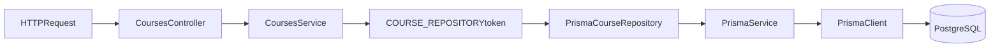

# Step 15 - ORM dengan Prisma di NestJS (Integrasi ke Project)

## 1. Tujuan Belajar

Setelah menyelesaikan step ini kamu diharapkan:

- Memahami konsep ORM dan trade-off dibanding raw SQL.
- Memahami komponen inti Prisma (`schema.prisma`, Prisma Client, migrations, seed).
- Mampu mengintegrasikan Prisma ke arsitektur repository pattern yang sudah ada.
- Mampu menjalankan workflow end-to-end: generate client -> migrate -> seed -> verifikasi API.

---

## 2. Kenapa pindah dari raw SQL ke ORM?

Di Step 14 kamu sudah belajar integrasi PostgreSQL via raw SQL.
Itu penting karena kamu paham apa yang benar-benar terjadi di database.

Sekarang, Prisma membantu kamu:

- menulis query dengan API TypeScript yang type-safe,
- mengurangi boilerplate SQL untuk operasi CRUD umum,
- menjaga konsistensi schema dan migration dalam satu workflow.

Raw SQL tetap relevan untuk query kompleks/performa tinggi, tapi ORM mempercepat banyak use case harian.

---

## 3. Konsep ORM secara ringkas

ORM (Object Relational Mapping) adalah lapisan yang memetakan:

- object/class di aplikasi
- ke table/record di database relasional.

Dengan ORM, operasi seperti create/update/find bisa ditulis sebagai method/object query,
bukan string SQL mentah setiap saat.

---

## 4. Prisma fundamentals

### 4.1 `schema.prisma`

File pusat untuk:

- konfigurasi datasource (`provider`, `url`),
- konfigurasi generator client,
- definisi model (contoh `Course`).

### 4.2 Prisma Client

Client TypeScript yang di-generate dari schema.
Digunakan di service/repository untuk query:

- `findMany`, `findUnique`, `create`, `update`, `delete`, dll.

### 4.3 Migrations

Prisma migration menyimpan perubahan schema secara versioned dan repeatable.
Ini penting agar environment team (dev/staging/prod) tetap sinkron.

### 4.4 Seeding

Seed dipakai untuk data awal/testing lokal.
Di step ini, seed mengisi table `courses` supaya endpoint bisa langsung diverifikasi.

---

## 5. Sintaks ORM yang sering dipakai (dan fungsinya)

Kalau kamu sering melihat `where`, `include`, dsb., itu memang **syntax query builder** di ORM
(dalam konteks ini: Prisma Client), bukan SQL mentah langsung.

### 5.1 `where` -> filter data

Dipakai untuk menyaring baris.

Contoh:

```ts
prisma.course.findMany({
  where: { title: { contains: 'nestjs', mode: 'insensitive' } },
});
```

### 5.2 `select` -> ambil field tertentu saja

Dipakai agar response lebih ringan (hindari over-fetching).

```ts
prisma.course.findMany({
  select: { id: true, title: true },
});
```

### 5.3 `include` -> ambil relasi sekaligus

Dipakai untuk eager loading relasi.

```ts
prisma.course.findUnique({
  where: { id: 1 },
  include: { lessons: true },
});
```

### 5.4 `orderBy` -> urutkan hasil

```ts
prisma.course.findMany({
  orderBy: { title: 'asc' },
});
```

### 5.5 `skip` + `take` -> pagination

```ts
prisma.course.findMany({
  skip: 20,
  take: 10,
});
```

### 5.6 `data` -> payload create/update

```ts
prisma.course.create({
  data: { title: 'Prisma Basics', description: 'Belajar ORM Prisma' },
});
```

### 5.7 `connect` / `disconnect` / `set` -> mengelola relasi

- `connect`: hubungkan ke record yang sudah ada
- `disconnect`: lepas relasi tertentu
- `set`: ganti seluruh kumpulan relasi

Contoh:

```ts
prisma.user.update({
  where: { id: 1 },
  data: {
    profile: { disconnect: true },
  },
});
```

### 5.8 `upsert` -> create jika belum ada, update jika sudah ada

```ts
prisma.user.upsert({
  where: { email: 'mentor@learning.local' },
  create: { email: 'mentor@learning.local' },
  update: {},
});
```

---

## 6. Arsitektur integrasi Prisma di project ini

Kita tetap menjaga prinsip dari Step 03 + Step 09:

- `CoursesService` tetap bergantung pada `ICourseRepository`,
- implementasi repository bisa ditukar lewat env (`COURSE_REPOSITORY_IMPL`),
- sekarang ditambah implementasi baru: `PrismaCourseRepository`.

Alur saat mode Prisma aktif:



---

## 7. Setup Prisma di repository ini

### 6.1 Dependency utama

- `prisma` (CLI)
- `@prisma/client` (runtime client)

### 6.2 File/folder penting

- `prisma/schema.prisma`
- `prisma/migrations/*`
- `prisma/seed.ts`
- `src/prisma/prisma.service.ts`
- `src/prisma/prisma.module.ts`
- `src/courses/repositories/prisma-course.repository.ts`

---

## 8. Workflow praktik (urutan eksekusi)

1. Pastikan `.env` sudah benar (`DATABASE_URL` ke PostgreSQL target).
2. Set mode repository:
   - `COURSE_REPOSITORY_IMPL=prisma`
3. Generate Prisma Client.
4. Jalankan migration Prisma.
5. Jalankan seed Prisma.
6. Start NestJS app.
7. Verifikasi:
   - `GET /learning/di` (harus menunjukkan `PrismaCourseRepository`)
   - CRUD endpoint `/courses`.

> Referensi command siap pakai ada di `docs/step-15-prisma-commands-and-verification.md`.

---

## 9. Mapping implementasi ke contract repository

`PrismaCourseRepository` tetap mengikuti `ICourseRepository`:

- `findAll()` -> `prisma.course.findMany()`
- `findOne(id)` -> `prisma.course.findUnique({ where: { id } })`
- `create(data)` -> `prisma.course.create({ data })`
- `update(id, data)` -> `prisma.course.update(...)` (dengan penanganan not found)
- `remove(id)` -> `prisma.course.delete(...)` (return boolean)

Dengan ini, `CoursesService` tidak perlu diubah saat storage diganti.

---

## 10. SQL vs ORM: perbandingan, risiko, dan mitigasi

### 10.1 Kenapa raw SQL bisa berbahaya?

Raw SQL bukan "buruk", tapi **berisiko** jika praktiknya tidak disiplin:

1. **SQL Injection**
   - Jika query dibangun dari string concatenation user input:
   - contoh berbahaya: `"SELECT * FROM users WHERE email = '" + email + "'"`.
2. **Human error pada UPDATE/DELETE**
   - lupa `WHERE` bisa mengubah/menghapus semua baris.
3. **Type mismatch & bug runtime**
   - typo nama kolom atau tipe baru ketahuan saat runtime.
4. **Maintainability menurun saat query banyak**
   - query string tersebar, sulit refactor ketika schema berubah.

### 10.2 Bagaimana ORM membantu mengurangi risiko ini?

1. **Parameterization by default**
   - Prisma mengirim query dengan binding parameter, bukan gabungan string mentah.
   - ini menurunkan risiko SQL injection pada operasi normal.
2. **Type-safe API**
   - field dan model mengikuti schema; typo sering tertangkap di compile time.
3. **Query intent lebih jelas**
   - `where`, `data`, `include` lebih mudah dibaca dibanding string SQL panjang.
4. **Schema & migration terintegrasi**
   - perubahan struktur data tercatat di migration, lebih konsisten antar environment.

### 10.3 Apakah ORM menghapus semua risiko?

Tidak 100%. Tetap perlu:

- validasi input (DTO + ValidationPipe),
- authorization yang benar,
- transaksi untuk operasi multi-step,
- review query berat/performa.

### 10.4 Kesimpulan praktis

- **Gunakan ORM sebagai default** untuk CRUD dan mayoritas flow bisnis.
- **Gunakan raw SQL secara selektif** untuk query khusus (agregasi kompleks/performa tertentu),
  tetap dengan parameterization + code review ketat.

---

## 11. Troubleshooting umum

- `prisma generate` gagal:
  - cek package terpasang, cek `schema.prisma` valid.
- migration gagal connect DB:
  - cek `DATABASE_URL`, cek PostgreSQL running.
- endpoint masih baca repository lama:
  - cek `COURSE_REPOSITORY_IMPL=prisma`, restart app.
- data kosong setelah start:
  - pastikan migration + seed sudah dijalankan.

---

## 12. Latihan mandiri (wajib)

1. Jalankan workflow Prisma end-to-end dari nol.
2. Verifikasi `GET /learning/di` menunjukkan Prisma aktif.
3. Uji semua endpoint CRUD `/courses`.
4. Tambahkan 1 course baru lalu buktikan datanya ada di database.
5. Dokumentasikan:
   - command yang dijalankan,
   - kendala utama,
   - solusi.

---

## 13. Checklist penilaian

- [ ] Bisa menjelaskan ORM vs raw SQL.
- [ ] Bisa menjelaskan fungsi `schema.prisma`, migration, seed, Prisma Client.
- [ ] Bisa menjelaskan fungsi syntax ORM: `where`, `select`, `include`, `orderBy`, `skip/take`, `data`.
- [ ] Bisa menjelaskan risiko SQL injection dan bagaimana ORM membantu mitigasinya.
- [ ] Bisa mengaktifkan mode Prisma lewat env.
- [ ] Bisa menjalankan migration + seed + verifikasi endpoint.
- [ ] Paham kenapa `CoursesService` tidak perlu diubah saat repository diganti.

---

## 14. Next Step (preview)

- **Step 16** — relasi `Course` → `Lesson`, pagination/filter di `GET /courses`, endpoint nested lesson: [`docs/step-16-relations-pagination-and-lessons.md`](step-16-relations-pagination-and-lessons.md) dan [`docs/step-16-commands-and-verification.md`](step-16-commands-and-verification.md).
- **Step 17** — pola relasi Prisma (1:1, 1:N, N:1, N:M) + blueprint join model many-to-many:
  - `docs/step-17-prisma-relationship-patterns.md`
  - `docs/step-17-commands-and-verification.md`
- Setelah itu: soft delete, otorisasi per resource.

