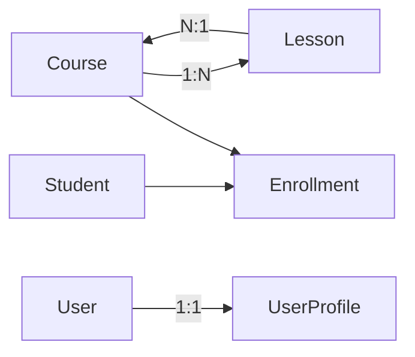

# Step 17 - Prisma Relationship Patterns (1:1, 1:N, N:1, N:M) di NestJS

## 1. Tujuan Belajar

Setelah step ini kamu diharapkan:

- Memahami 4 pola relasi database paling umum: **one-to-one**, **one-to-many**, **many-to-one**, **many-to-many**.
- Mampu memodelkan relasi tersebut di **Prisma** lewat `schema.prisma` (PK, FK, `@relation`, `@@index`, `@unique`).
- Mampu menulis query Prisma untuk relasi: `include`, nested write (`create`), `connect`, `disconnect`, `set`.
- Mampu memetakan relasi Prisma ke arsitektur NestJS (controller -> service -> repository/service layer).

> **Catatan implementasi repo saat ini:**
> - **1:N** dan **N:1** sudah aktif lewat `Course` <-> `Lesson` (Step 16).
> - **1:1** sudah aktif lewat `User` <-> `UserProfile`.
> - **N:M** sudah aktif lewat `Student` <-> `Course` menggunakan join model `Enrollment`.

---

## 2. Relasi yang aktif di project

Lihat `prisma/schema.prisma`:

- `Course.lessons[]` <-> `Lesson.course` (**1:N / N:1**)
- `User.profile?` <-> `UserProfile.user` + `userId @unique` (**1:1**)
- `Student.enrollments[]` <-> `Course.enrollments[]` via `Enrollment` (**N:M explicit join table**)

---

## 3. One-to-one (1:1) - User dan UserProfile

### 3.1 Inti desain

1:1 dibentuk dengan FK yang diberi **unique constraint**.

- `UserProfile.userId` adalah FK ke `User.id`
- `userId` juga `@unique`, jadi satu user maksimal satu profile

### 3.2 Query pattern

- Buat user + profile sekaligus (nested create):
  - `prisma.user.create({ data: { email, profile: { create: {...} } } })`
- Ambil user + profile:
  - `prisma.user.findUnique({ include: { profile: true } })`

### 3.3 Endpoint demo di project

- `POST /learning/relations/one-to-one/users`
- `GET /learning/relations/one-to-one/users/:userId`

---

## 4. One-to-many (1:N) dan Many-to-one (N:1) - Course dan Lesson

### 4.1 Inti desain

- Parent: `Course { lessons Lesson[] }`
- Child: `Lesson { courseId Int; course Course @relation(...) }`

### 4.2 Query pattern

- Ambil course + lessons:
  - `prisma.course.findUnique({ include: { lessons: true } })`
- Ambil lessons by `courseId`:
  - `prisma.lesson.findMany({ where: { courseId } })`

### 4.3 Endpoint demo di project

- `GET /courses/:id?includeLessons=true`
- `GET /courses/:courseId/lessons`
- `POST /courses/:courseId/lessons`
- `DELETE /courses/:courseId/lessons/:lessonId`

---

## 5. Many-to-many (N:M) - Student dan Course via Enrollment

### 5.1 Kenapa explicit join model?

Join model `Enrollment` memberi fleksibilitas:

- bisa tambah atribut relasi (`enrolledAt`, status, grade, dll.)
- bisa enforce unique pasangan student-course via composite key

### 5.2 Pola schema

- `Enrollment` menyimpan `studentId`, `courseId`, `enrolledAt`
- `@@id([studentId, courseId])` mencegah enroll duplikat
- `@@index([courseId])` mempercepat query daftar peserta per course

### 5.3 Query pattern

- Enroll student:
  - `prisma.enrollment.create({ data: { studentId, courseId } })`
- Ambil student + daftar course:
  - `prisma.student.findUnique({ include: { enrollments: { include: { course: true } } } })`
- Ambil course + daftar student:
  - `prisma.course.findUnique({ include: { enrollments: { include: { student: true } } } })`

### 5.4 Endpoint demo di project

- `POST /learning/relations/many-to-many/enrollments`
- `GET /learning/relations/many-to-many/students/:studentId`
- `GET /learning/relations/many-to-many/courses/:courseId`

---

## 6. Pitfalls yang sering bikin bingung

- **1:1 tidak valid tanpa unique FK**: pastikan field FK diberi `@unique`.
- **Over-fetching**: `include` bersarang bisa besar; gunakan `select` saat perlu.
- **Cascade delete**: cek dampak sebelum dipakai di parent relation.
- **Composite key**: untuk N:M explicit, kunci gabungan mencegah duplikasi.
- **Migration order**: update schema -> migrate -> generate -> seed -> verifikasi endpoint.

---

## 7. Checklist penilaian

- [ ] Bisa menjelaskan perbedaan 1:1, 1:N, N:1, N:M.
- [ ] Bisa menunjukkan `@unique` pada FK sebagai inti 1:1.
- [ ] Bisa menjelaskan kenapa N:M pakai join table `Enrollment`.
- [ ] Bisa menjalankan endpoint learning untuk 1:1 dan N:M.
- [ ] Bisa mengaitkan teori relasi dengan implementasi Course/Lesson (Step 16).

---

## 8. Next Step (preview)

- **Step 18** — authentication & authorization (JWT, guards, role): [`docs/step-18-nestjs-authentication-authorization.md`](step-18-nestjs-authentication-authorization.md) dan [`docs/step-18-commands-and-verification.md`](step-18-commands-and-verification.md).
- Transaction tingkat lanjut (multi-step write + rollback strategy).
- Soft delete + audit field.
