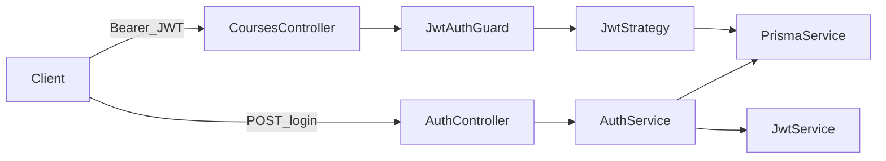
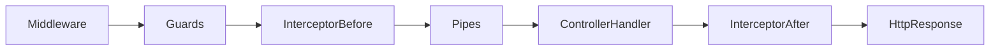

# Step 18 - Authentication & Authorization di NestJS (JWT + Guards)

## 1. Tujuan Belajar

Setelah step ini kamu diharapkan:

- Membedakan **authentication** (siapa kamu?) dan **authorization** (apa yang boleh kamu lakukan?).
- Memahami perbedaan **session-based auth** vs **JWT-based auth** dan kapan masing-masing cocok.
- Mampu memasang **Guard** di NestJS dan memahami urutannya relatif terhadap middleware/pipes.
- Mampu mengikuti alur JWT di project ini: login → token → `Authorization: Bearer` → route terlindungi.
- Mampu menambahkan **role-based** check sederhana (`admin` vs `student`) pada satu endpoint.

---

## 2. Authentication vs Authorization

| Istilah | Arti | Contoh di API |
|--------|------|----------------|
| **Authentication** | Membuktikan identitas pengguna | Login dengan email + password, lalu server mengeluarkan JWT |
| **Authorization** | Memutuskan apakah identitas itu **diizinkan** melakukan aksi | Hanya `admin` yang boleh `DELETE /courses/:id` |

Guard di Nest bisa dipakai untuk keduanya: `JwtAuthGuard` biasanya untuk auth; `RolesGuard` untuk authorization.

---

## 3. Session-based vs JWT-based

### 3.1 Session-based (ringkas)

Alur tipikal:

1. User login → server cek password → simpan **session** di server (memory/Redis/database).
2. Server kirim **cookie** berisi **session id** ke browser.
3. Request berikutnya membawa cookie → server lookup session → tahu siapa user-nya.

**Kelebihan:** token tidak perlu disimpan di client storage; revoke mudah (hapus session).

**Keterbatasan:** butuh penyimpanan session; scaling horizontal perlu sticky session atau shared store; API murni (mobile/SPA) sering lebih nyaman dengan bearer token.

> **Di repo ini:** session **tidak** diimplementasikan di kode — hanya konsep. Contoh modul sketsa:

```typescript
// Ilustrasi saja (tidak ada di repo)
// app.use(session({ secret: '...', resave: false, saveUninitialized: false }));
// Passport + passport-local -> req.user, req.isAuthenticated()
```

Perhatikan **CSRF** untuk cookie-based form POST di browser.

### 3.2 JWT-based (yang dipakai di repo ini)

1. User login → server validasi password → **`JwtService.sign`** menghasilkan string JWT.
2. Client menyimpan JWT (memory / secure storage) dan mengirim header `Authorization: Bearer <token>`.
3. **`JwtStrategy`** memverifikasi tanda tangan + expiry → mengisi `request.user`.

**Kelebihan:** stateless server (tanpa session store per request); cocok untuk API dan mobile.

**Keterbatasan:** revoke token sulit sebelum expiry (perlu denylist atau refresh-token flow — **di luar scope** step ini).



---

## 4. Komponen NestJS yang relevan

Bagian ini menjelaskan tiga lapisan yang bekerja sama di project: **Guard** (Nest), **Passport** (strategi ekstraksi + verifikasi kredensial), dan **`@nestjs/jwt`** (penandatanganan & verifikasi token).

---

### 4.1 Guard

#### Apa itu Guard?

**Guard** adalah class yang mengimplementasikan `CanActivate`. Nest memanggil guard **sebelum** route handler dijalankan. Guard menjawab pertanyaan: *“apakah request ini boleh melanjutkan ke controller method?”*

- Mengembalikan `true` → request lanjut ke handler (dan ke guard berikutnya jika ada).
- Mengembalikan `false` → Nest memutus request (biasanya **403 Forbidden**).
- Melempar exception (misalnya `UnauthorizedException`) → Nest mengembalikan status HTTP sesuai exception (misalnya **401**).

Guard cocok untuk **authentication** dan **authorization** karena keputusan “siapa user ini?” dan “apakah role-nya cukup?” terjadi tepat sebelum logika bisnis di controller.

#### Urutan eksekusi (middleware vs guard vs pipe vs interceptor)

Secara garis besar untuk satu request HTTP:

1. **Middleware** (Express layer) — contoh: `X-Request-Id`, logging. Lihat [docs/step-06-middleware.md](step-06-middleware.md).
2. **Guard** — auth / role / policy.
3. **Interceptor** (sebelum handler) — contoh: logging durasi. Lihat [docs/step-07-interceptors.md](step-07-interceptors.md).
4. **Pipe** — transform & validasi DTO (misalnya `ValidationPipe`).
5. **Controller handler** — bisnis utama.
6. **Interceptor** (sesudah handler) — contoh: wrap response sukses.

Jadi pernyataan “guard jalan setelah middleware, sebelum pipe pada fase pra-handler” membantu mahasiswa menempatkan **di mana** auth dicek: setelah request masuk aplikasi, **sebelum** validasi body dan **sebelum** handler.

Diagram alur (satu request, fase pra-handler → handler → pasca-handler):



- **Guards** (termasuk `JwtAuthGuard` / `RolesGuard`) berada **setelah** middleware yang kamu daftarkan untuk route itu, dan **sebelum** pipe validasi body.
- **InterceptorAfter** di repo ini termasuk yang membungkus body sukses (`WrapResponseInterceptor`). Penjelasan interceptor dan contoh kode: [docs/step-07-interceptors.md](step-07-interceptors.md).

#### Cara memasang Guard

| Cara | Contoh | Kapan dipakai |
|------|--------|----------------|
| Per method | `@UseGuards(JwtAuthGuard)` di atas `@Post()` | Satu endpoint saja butuh auth |
| Per controller | `@UseGuards(JwtAuthGuard)` di atas `@Controller('courses')` | Semua route di controller itu |
| Global | `app.useGlobalGuards(new JwtAuthGuard())` di `main.ts` | Semua route (sering dipasangkan dengan decorator `@Public()` untuk pengecualian) |

**Scope:** decorator di **method** mengoverride atau menambah guard dibanding level **controller** sesuai aturan Nest (method + controller guards digabung).

#### Beberapa Guard sekaligus

```typescript
@UseGuards(JwtAuthGuard, RolesGuard)
@Roles('admin')
@Delete(':id')
remove(@Param('id') id: string) { ... }
```

- Guard dievaluasi **dari kiri ke kanan**.
- **`JwtAuthGuard`** jalan dulu: jika token tidak valid / tidak ada, request gagal di sini (biasanya 401) dan **`RolesGuard` tidak dipanggil**.
- **`RolesGuard`** jalan jika JWT lolos: membaca metadata `@Roles(...)` dan membandingkan dengan `request.user.role`.

Urutan ini penting: **selalu letakkan auth sebelum authorization** (`JwtAuthGuard` sebelum `RolesGuard`).

#### Guard vs Middleware untuk auth

| Aspek | Middleware | Guard |
|--------|------------|--------|
| Akses ke DI Nest penuh | Terbatas | Ya (`@Injectable`, inject service) |
| Integrasi Passport / JWT strategy | Tidak idiomatic | Ya (`AuthGuard('jwt')`) |
| Cocok untuk “user ter-auth?” | Kurang | Sangat cocok |

Karena itu NestJS resmi mengarahkan **authentication** ke Guard (dan strategy), bukan ke middleware.

---

### 4.2 Passport + `@nestjs/passport`

Passport adalah ekosistem **strategy** untuk berbagai cara login (local, JWT, OAuth, dll.). **`@nestjs/passport`** menyatukan Passport dengan lifecycle Nest (DI, module, guard).

#### Strategy

**Strategy** menjawab: *“dari request HTTP ini, bagaimana saya mengambil kredensial dan memverifikasi identitas?”*

Untuk JWT, alurnya:

1. **Ekstraksi token** — misalnya dari header `Authorization: Bearer <token>` (`ExtractJwt.fromAuthHeaderAsBearerToken()`).
2. **Verifikasi** — cek tanda tangan dan `exp` memakai **secret yang sama** dengan saat `sign` (dikonfigurasi di `JwtModule` / strategy).
3. **Validasi payload** — method `validate(payload)` di class kamu dipanggil dengan isi payload (decoded) setelah token dianggap sah.

Di project ini, lihat `src/auth/jwt.strategy.ts`:

- Class extends `PassportStrategy(Strategy, 'jwt')`.
- String **`'jwt'`** adalah **nama strategy** yang harus **persis sama** dengan yang dipanggil di guard.

#### Menghubungkan Strategy dengan Guard

```typescript
// jwt-auth.guard.ts — nama strategy = 'jwt'
@Injectable()
export class JwtAuthGuard extends AuthGuard('jwt') {}
```

`AuthGuard('jwt')` memberi tahu Passport: *“untuk request ini, pakai strategy yang terdaftar dengan nama `jwt`”*.

Jika nama tidak cocok (misalnya strategy `'jwt'` tapi guard `AuthGuard('jwt-auth')`), guard tidak akan menemukan strategy → error runtime.

#### Apa yang terjadi dengan return value `validate()`?

Nilai yang dikembalikan dari `validate()` di **JwtStrategy** akan disematkan Nest ke **`request.user`** (pada HTTP context). Itulah yang dibaca **`RolesGuard`** dan bisa dipakai di controller dengan `@Req() req`.

Contoh return di repo: `{ id, email, role }` — konsisten dengan kebutuhan authorization.

#### Modul yang mendaftarkan strategy

`JwtStrategy` harus terdaftar sebagai **provider** di sebuah module yang di-import aplikasi (di repo: `AuthModule`). Tanpa itu, Passport tidak pernah menginstansiasi strategy dan guard akan gagal.

---

### 4.3 `@nestjs/jwt`

Paket ini menyediakan integrasi **jsonwebtoken** dengan Nest: konfigurasi terpusat di module dan injeksi **`JwtService`** ke service manapun.

#### `JwtModule`

**Tugas:** mendaftarkan secret, algoritma (default HS256 untuk symmetric secret), dan opsi default untuk `sign` / `verify`.

Di repo dipakai **`JwtModule.registerAsync`** agar `JWT_SECRET` dan `JWT_EXPIRES_IN` dibaca dari **`ConfigService`** (environment), bukan hardcode:

- **`secret`** — kunci simetris untuk menandatangani dan memverifikasi token. Harus panjang dan acak di production; sama antara proses `sign` (login) dan verifikasi (strategy).
- **`signOptions.expiresIn`** — umur token (misalnya `'1d'`, `'15m'`). Setelah lewat, verifikasi gagal dengan error expiry.

`JwtModule` di-import di `AuthModule`; dengan begitu **`JwtService`** bisa di-inject ke `AuthService` (dan hanya modul yang import / export `JwtModule` yang mendapat akses, kecuali `JwtModule` di-export dari `AuthModule` — di repo sudah di-export untuk fleksibilitas).

#### `JwtService`

| Method | Peran di project |
|--------|-------------------|
| **`sign` / `signAsync`** | Dipanggil di `AuthService.login()` untuk membuat string JWT dari payload (`sub`, `email`, `role`). |
| **`verify` / `verifyAsync`** | Bisa dipakai manual; pada alur Passport, verifikasi token untuk request masuk biasanya ditangani oleh **passport-jwt strategy** + secret yang kamu set di `JwtStrategy` constructor (`secretOrKey` harus sama dengan `JwtModule`). |

**Catatan penting:** payload JWT **boleh dibaca client** (base64); jangan taruh rahasia di payload. `passwordHash` **tidak** dimasukkan ke JWT di repo ini — hanya id, email, role.

#### Alur ringkas: login vs request berikutnya

1. **Login:** `AuthService` validasi password (bcrypt + Prisma) → `jwt.signAsync(payload)` → client simpan `access_token`.
2. **Request protected:** header `Authorization: Bearer ...` → `JwtAuthGuard` → Passport + `JwtStrategy` verifikasi tanda tangan & expiry → `validate()` load user dari DB → `request.user` tersedia untuk handler dan `RolesGuard`.

---

## 5. Implementasi di repository ini (file map)

Bagian ini menjelaskan **urutan pemanggilan kode** yang sudah ada di repo: dari HTTP request masuk sampai handler (atau error), termasuk siapa yang memanggil siapa.

### 5.1 Alur A — Login: `POST /auth/login`

1. **HTTP** masuk ke aplikasi. Rute `POST /auth/login` **tidak** melalui middleware khusus course (`requestIdMiddleware`, `loggerMiddleware`, `rateLimitMiddleware` di `CoursesModule` hanya dipasang untuk `CoursesController` / `CourseLessonsController`).
2. **`ValidationPipe` global** (`src/main.ts`) memvalidasi body terhadap `LoginDto` (`src/auth/dto/login.dto.ts`) sebelum masuk handler.
3. **`AuthController.login`** (`src/auth/auth.controller.ts`) memanggil `this.authService.login(dto)`.
4. **`AuthService.login`** (`src/auth/auth.service.ts`):
   - Memanggil **`validateUser`**: `PrismaService` mengambil user by email; **`bcrypt.compare`** membandingkan password plain dengan `user.passwordHash`. Jika gagal → **`UnauthorizedException`** (401).
   - Membentuk **`JwtPayload`** (`sub`, `email`, `role`) lalu **`JwtService.signAsync`** (dari **`JwtModule`** yang dikonfigurasi di `src/auth/auth.module.ts` dengan `JWT_SECRET` / `JWT_EXPIRES_IN`) menghasilkan string **`access_token`**.
5. Response JSON `{ access_token, user: { id, email, role } }` keluar; **`LoggingInterceptor`** dan **`WrapResponseInterceptor`** global membungkus body sukses seperti endpoint lain.

**Ringkas:** `AuthController` → `AuthService` → Prisma + bcrypt → `JwtService.sign` → response. **Tidak** melalui `JwtStrategy` atau `JwtAuthGuard` (login adalah endpoint publik).

---

### 5.2 Alur B — Route terlindungi JWT (contoh `POST /courses`, `PATCH /courses/:id`, `POST /courses/:courseId/lessons`, …)

1. **Middleware course** (jika path cocok): `requestIdMiddleware` → `loggerMiddleware` → `rateLimitMiddleware` (`src/courses/courses.module.ts`).
2. **`JwtAuthGuard`** pada method (`@UseGuards(JwtAuthGuard)` di `courses.controller.ts` / `course-lessons.controller.ts`) dijalankan **sebelum** handler. Guard ini adalah **`AuthGuard('jwt')`** (`src/auth/jwt-auth.guard.ts`).
3. **Passport** (via `@nestjs/passport`) memilih strategy bernama **`jwt`**, yaitu **`JwtStrategy`** (`src/auth/jwt.strategy.ts`), karena class tersebut memanggil `PassportStrategy(Strategy, 'jwt')`.
4. **Library `passport-jwt`**: membaca header **`Authorization: Bearer <token>`** (`ExtractJwt.fromAuthHeaderAsBearerToken()`), memverifikasi tanda tangan dan expiry dengan **`JWT_SECRET`** yang sama seperti saat login. Jika token invalid / kedaluwarsa → alur berhenti dengan **401** (tanpa memanggil `validate` atau handler).
5. Jika token valid, Passport memanggil **`JwtStrategy.validate(payload)`** dengan isi payload yang sudah diverifikasi. Method ini memuat user terkini dari DB (`prisma.user.findUnique` by `payload.sub`). Jika user tidak ada → **`UnauthorizedException`**. Return value `{ id, email, role }` disematkan ke **`request.user`**.
6. Setelah semua guard lolos, **interceptor global** (fase “before”) → **`ValidationPipe`** memvalidasi `@Body()` DTO → **`CoursesController.create`** (atau method lain) memanggil **`CoursesService`** → bisnis utama.
7. Response melewati interceptor “after” (logging + wrap).

**Ringkas:** middleware (course) → **`JwtAuthGuard`** → Passport + **`JwtStrategy`** (verify JWT → `validate` → `request.user`) → pipe → controller → service.

---

### 5.3 Alur C — `DELETE /courses/:id` (JWT + hanya `admin`)

Sama seperti alur B untuk tahap awal, lalu guard **kedua** dijalankan (urutan decorator: kiri ke kanan):

1. **`JwtAuthGuard`** — seperti §5.2; memastikan `request.user` terisi.
2. **`RolesGuard`** (`src/auth/roles.guard.ts`): **`Reflector`** membaca metadata **`@Roles('admin')`** (`src/auth/roles.decorator.ts`). Jika role user tidak termasuk daftar yang dibolehkan → **`ForbiddenException`** (403). Jika tidak ada `@Roles` pada handler, guard ini **melewati** (return `true`).

**Ringkas:** setelah JWT valid → **`RolesGuard`** mengecek **`request.user.role`** terhadap metadata decorator.

---

### 5.4 Modul & injeksi (mengapa guard bisa dipakai di `CoursesModule`)

- **`AppModule`** mengimpor **`AuthModule`** dan **`CoursesModule`** (`src/app.module.ts`).
- **`CoursesModule`** mengimpor **`AuthModule`** (`src/courses/courses.module.ts`) agar provider yang diekspor (`JwtAuthGuard`, `RolesGuard`, dll.) tersedia untuk controller course.
- **`AuthModule`** mendaftarkan **`PassportModule`**, **`JwtModule.registerAsync`**, serta provider **`JwtStrategy`** — strategy harus terdaftar agar `AuthGuard('jwt')` menemukan implementasinya.

---

| File | Fungsi |
|------|--------|
| `prisma/schema.prisma` | `User.passwordHash`, `User.role` untuk login & RBAC demo |
| `prisma/seed.ts` | User seed dengan hash bcrypt |
| `src/auth/auth.module.ts` | Registrasi `JwtModule`, `AuthService`, `JwtStrategy`, controller |
| `src/auth/auth.service.ts` | Validasi password, `login()`, `sign` JWT |
| `src/auth/auth.controller.ts` | `POST /auth/login` |
| `src/auth/jwt.strategy.ts` | Validasi bearer JWT, load user dari DB |
| `src/auth/jwt-auth.guard.ts` | Thin wrapper `AuthGuard('jwt')` |
| `src/auth/roles.decorator.ts` | `@Roles('admin')` metadata |
| `src/auth/roles.guard.ts` | Cek `request.user.role` |
| `src/auth/dto/login.dto.ts` | Validasi body login |
| `src/app.module.ts` | Import `AuthModule` |
| `src/main.ts` | Swagger `addBearerAuth` |
| `src/courses/courses.controller.ts` | JWT pada `POST`/`PATCH`; `admin` pada `DELETE` |
| `src/courses/course-lessons.controller.ts` | JWT pada `POST`/`DELETE` lesson |

**Kebijakan demo:**

- `GET /courses` dan `GET /courses/:id` → **publik** (tanpa token).
- `POST` / `PATCH` course → butuh **JWT** (role `student` atau `admin`).
- `DELETE /course` → butuh JWT + role **`admin`**.
- Lesson `POST` / `DELETE` → butuh JWT (satu guard saja untuk demo).

---

## 6. Payload JWT

Payload berisi minimal:

- `sub`: id user (standar JWT)
- `email`
- `role`

Strategy mengambil user terbaru dari database berdasarkan `sub` agar role tidak hanya percaya payload lama (tanpa revokasi token, ini tetap kompromi — dokumentasikan sebagai trade-off pembelajaran).

---

## 7. Checklist penilaian

- [ ] Bisa menjelaskan beda authentication vs authorization.
- [ ] Bisa menjelaskan beda session vs JWT secara konsep.
- [ ] Bisa menjelaskan urutan **middleware → guard → interceptor/pipe → handler** dan posisi guard untuk auth.
- [ ] Bisa menjelaskan hubungan nama strategy Passport (`'jwt'`) dengan `AuthGuard('jwt')`.
- [ ] Bisa mendemokan login dan memanggil endpoint terlindungi dengan `Authorization: Bearer`.
- [ ] Bisa menjelaskan fungsi `JwtStrategy.validate` dan isi `request.user`.
- [ ] Bisa menjelaskan peran `JwtModule` vs `JwtService` vs verifikasi di strategy.
- [ ] Bisa menjelaskan kenapa `DELETE` course membutuhkan role `admin`.
- [ ] Bisa menceritakan **alur A** (login tanpa guard/strategy) vs **alur B/C** (guard → Passport → `JwtStrategy` → `request.user`, lalu `RolesGuard` bila ada).

---

## 8. Next Step (preview)

- Refresh token + revoke / denylist.
- OAuth2 (Google, GitHub).
- Policy-based authorization per resource (misalnya pemilik course saja).
