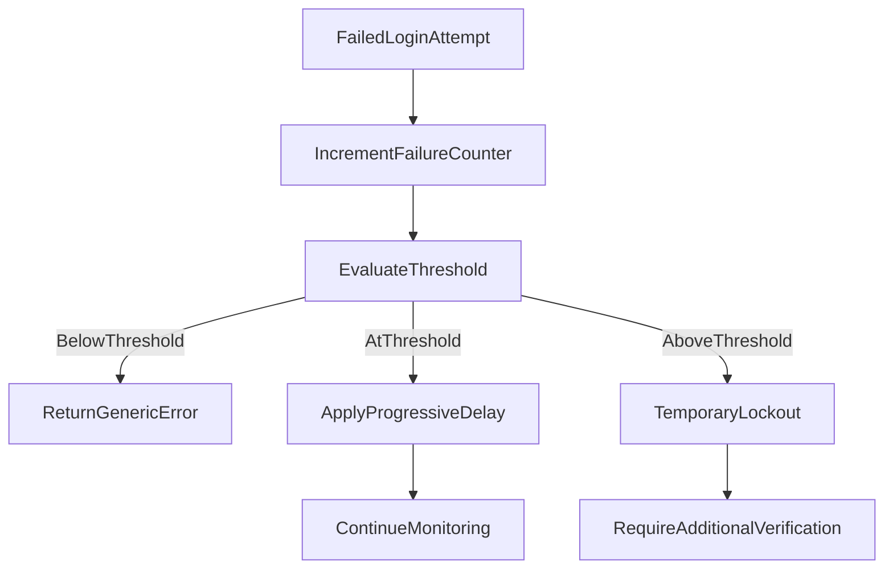
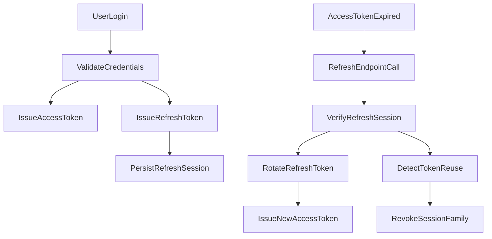

# Step 19 - Advanced Authentication & Security Concepts

## 1. Tujuan Belajar

Setelah step ini kamu diharapkan:

- Memahami desain auth yang lebih aman untuk production, bukan hanya login JWT dasar.
- Menjelaskan kenapa `password_hash` harus diproses dengan algoritme adaptive hashing (`bcrypt`, `argon2`) dan bukan disimpan plaintext.
- Menjelaskan trade-off antara UX vs security pada policy password, lockout, dan rate limiting.
- Memahami arsitektur `access token` + `refresh token` termasuk `rotation`, `reuse detection`, dan revocation.
- Memahami evolusi authorization dari RBAC sederhana ke model kebijakan yang lebih granular.
- Memahami kapan CSP dan CSRF relevan, serta cara mitigasi yang tepat berdasarkan mekanisme auth.

---

## 2. Threat Model Singkat (untuk API ini)

Sebelum menentukan kontrol keamanan, tentukan dulu apa yang dilindungi:

- **Aset utama**: kredensial user, token, data course/lesson, role user (`admin`/`student`), secret JWT.
- **Penyerang yang realistis**:
  - brute-force login / credential stuffing
  - token theft (leak dari storage/log/network)
  - privilege escalation (pakai role yang tidak semestinya)
  - abuse API volume tinggi (DoS ringan / spam)
- **Attack surface**:
  - `POST /auth/login`
  - endpoint yang dilindungi `JwtAuthGuard`
  - endpoint sensitif dengan role terbatas (`DELETE /courses/:id`)
  - konfigurasi deployment (TLS, header, secret env, logging)

Prinsip penting: **security adalah layer**, bukan satu fitur tunggal.

---

## 3. Password Hashing (`password_hash`)

### 3.1 Hashing vs encryption

- **Hashing**: one-way, tidak bisa dibalik ke plaintext.
- **Encryption**: two-way, bisa didekripsi dengan key.

Untuk password user, gunakan **hashing**, bukan encryption. Di repo ini password sudah disimpan sebagai `passwordHash` dan diverifikasi via `bcrypt.compare`.

### 3.2 Kenapa `bcrypt`/`argon2`?

Algoritme seperti `bcrypt` dan `argon2` didesain **lambat** secara terkontrol sehingga serangan brute force jadi mahal.

- `bcrypt`: berbasis cost factor (`2^cost`) untuk mengatur beban komputasi.
- `argon2id`: modern, memory-hard, umumnya direkomendasikan untuk deployment baru.

### 3.3 Praktik production

- Simpan hanya hash (mis. `password_hash`), bukan password plaintext.
- Gunakan salt unik per password (otomatis oleh `bcrypt`).
- Pertimbangkan `pepper` (secret tambahan tingkat aplikasi, disimpan di secret manager) jika threat model menuntut.
- Terapkan **rehash policy**: jika parameter hash lama terlalu lemah, upgrade hash saat user login sukses.

### 3.4 Password policy (strength)

Contoh baseline policy:

- minimum 12 karakter (lebih baik daripada hanya “8 karakter + simbol”).
- blok password umum/lemah (`password123`, pola keyboard, dsb).
- idealnya cek terhadap daftar password bocor (`breached password` dataset/API).
- hindari aturan terlalu kaku yang membuat user cenderung menulis password di tempat tidak aman.

---

## 4. Account Protection setelah Failed Authentication

Validasi password yang kuat saja tidak cukup. Endpoint login harus tahan abuse.

### 4.1 Pola proteksi umum

- **Progressive delay**: tambah delay tiap kegagalan beruntun.
- **Exponential backoff**: jeda bertambah eksponensial setelah threshold.
- **Temporary lockout**: akun dikunci sementara setelah N kegagalan.
- **Step-up verification**: minta verifikasi tambahan (captcha/OTP) saat risiko tinggi.

### 4.2 Prinsip implementasi

- Balasan error login dibuat **generik** (jangan bocorkan apakah email terdaftar).
- Catat event keamanan (gagal login, lockout, unlock) untuk audit/monitoring.
- Pisahkan counter berdasarkan dimensi yang tepat: akun, IP, fingerprint perangkat (sesuai privasi dan regulasi).
- Pastikan lockout tidak mudah dijadikan alat DoS terhadap user sah.

### 4.3 Diagram alur failed login

---

## 5. Access Token + Refresh Token Architecture

Di Step 18, repo ini fokus pada `access token` JWT. Untuk production, biasanya dibutuhkan refresh flow.

### 5.1 Peran masing-masing token

- **Access token**: umur pendek (mis. 5-15 menit), dipakai akses API.
- **Refresh token**: umur lebih panjang (mis. 7-30 hari), dipakai mint access token baru tanpa login ulang.

### 5.2 Storage strategy (high level)

- **SPA/browser**:
  - access token di memori (mengurangi persistensi jika XSS terjadi)
  - refresh token biasanya di cookie `HttpOnly + Secure + SameSite` (jika arsitektur mendukung)
- **Mobile/native**:
  - simpan token di secure storage OS (Keychain/Keystore)

Tidak ada satu pilihan yang absolut; keputusan mengikuti ancaman utama (XSS vs CSRF vs token theft).

### 5.3 Rotation, reuse detection, revocation

Flow yang direkomendasikan:

1. Refresh token dipakai di endpoint refresh.
2. Server validasi token + sesi.
3. Server menerbitkan refresh token baru (**rotation**) dan menonaktifkan token lama.
4. Jika token lama dipakai lagi, anggap **reuse attack** dan revoke seluruh keluarga sesi (`session family`).

Untuk ini, biasanya perlu tabel sesi/token di database (`token_jti`, `user_id`, `expires_at`, `revoked_at`, `parent_jti`, metadata perangkat/IP).

### 5.4 Diagram refresh token lifecycle

---

## 6. RBAC Lanjutan

Di repo saat ini sudah ada RBAC sederhana (`@Roles('admin')` + `RolesGuard`).

Untuk kebutuhan lebih kompleks:

- **Role hierarchy**: contoh `super_admin > admin > editor > student`.
- **Scope/resource-level check**: bukan hanya role global, tapi juga kepemilikan resource (mis. hanya pemilik course boleh update).
- **Policy-based authorization**:
  - `RBAC` bagus untuk awal
  - bisa berkembang ke `ABAC`/`PBAC` saat aturan makin kompleks

Prinsip: authorization idealnya dievaluasi dekat konteks resource, bukan hanya role statis.

---

## 7. CSP (Content Security Policy)

`CSP` adalah header browser untuk mengontrol sumber script/style/frame/resource sehingga dampak XSS bisa dikurangi.

### 7.1 Kapan relevan?

- Sangat relevan untuk aplikasi web yang merender HTML/JS.
- Untuk API JSON murni, efek langsung CSP lebih kecil; tetap penting jika ada halaman docs/admin UI yang diakses browser.

### 7.2 Baseline kebijakan (contoh konsep)

- Batasi `script-src` ke sumber tepercaya.
- Hindari `unsafe-inline` jika memungkinkan.
- Gunakan nonce/hash untuk script inline yang memang diperlukan.
- Kombinasikan dengan secure headers lain (`X-Content-Type-Options`, `Referrer-Policy`, dll).

Di NestJS biasanya diterapkan lewat middleware/security package (misalnya Helmet) dengan konfigurasi eksplisit.

---

## 8. CSRF (Cross-Site Request Forgery)

### 8.1 Kapan CSRF menjadi masalah?

CSRF relevan saat browser otomatis mengirim credential (umumnya cookie session / cookie refresh token lintas request).

- **Cookie-based auth/session**: risiko CSRF tinggi, wajib mitigasi.
- **Bearer token di header Authorization** (manual attach oleh client JS): risiko CSRF jauh lebih rendah, tetapi ancaman XSS harus dijaga.

### 8.2 Mitigasi umum

- `SameSite` cookie (`Lax`/`Strict` sesuai kebutuhan).
- CSRF token (`synchronizer token` atau `double submit cookie` pattern).
- Validasi `Origin`/`Referer` untuk endpoint sensitif (dengan kehati-hatian compatibility).

Intinya: mitigasi dipilih sesuai mekanisme auth yang dipakai, bukan diterapkan buta.

---

## 9. Rate Limiting & Abuse Protection

Rate limiting adalah kontrol penting untuk mencegah brute force dan abuse API.

### 9.1 Dimensi limit

- per IP
- per user/account
- per endpoint (login biasanya paling ketat)
- per tenant/API key (jika ada multi-tenant/integrasi eksternal)

### 9.2 Layering

- **Edge layer**: CDN/WAF/API Gateway untuk serangan volume besar.
- **Application layer**: guard/middleware untuk kontrol berbasis konteks domain.
- **Data layer**: storage counter yang konsisten (Redis umum dipakai untuk distribusi).

### 9.3 Best practices

- Bedakan endpoint publik vs endpoint sensitif.
- Kembalikan status yang tepat (mis. `429 Too Many Requests`) + header retry yang informatif.
- Kombinasikan dengan lockout/step-up verification untuk endpoint login.

---

## 10. Other Advanced Security Concepts (Ringkas)

Topik penting lain yang sebaiknya ada di roadmap:

- **HTTPS everywhere** + `HSTS`.
- **CORS hardening**: whitelist origin yang jelas; hindari wildcard untuk credentialed requests.
- **Secret management**: simpan secret di vault/manager, bukan hardcoded.
- **JWT key rotation**: jadwal rotasi secret/keys dan strategi transisi.
- **Audit log**: event auth penting (login sukses/gagal, refresh, revoke, role change).
- **Monitoring & alerting**: deteksi anomali login dan lonjakan error auth.
- **Dependency security**: scan CVE, patch rutin, review transitive dependency.
- **Least privilege**: hak minimum untuk service account, DB user, dan runtime environment.
- **Incident response basics**: prosedur revoke massal token, rotasi secret darurat, komunikasi insiden.

---

## 11. Mapping ke Kondisi Repository Saat Ini

### 11.1 Sudah diimplementasikan

- Password diverifikasi dengan `bcrypt.compare` dan disimpan sebagai `passwordHash`.
- JWT `access token` + `refresh token` diterbitkan saat login.
- Endpoint `POST /auth/refresh` tersedia untuk refresh + rotasi refresh token.
- Refresh token disimpan dalam bentuk hash (`refreshTokenHash`) + expiry di database.
- Proteksi login gagal berulang aktif via `failedLoginAttempts` + `lockUntil`.
- Endpoint tertentu diproteksi `JwtAuthGuard`.
- RBAC dasar lewat `RolesGuard` + `@Roles('admin')`.
- Ada middleware rate limit demo di jalur courses dan rate limit khusus endpoint auth.
- Security headers baseline aktif (`CSP`, `X-Frame-Options`, `X-Content-Type-Options`, dll).

### 11.2 Belum diimplementasikan (rekomendasi production)

- Session table khusus refresh token family (multi-device granularity).
- Reuse-detection yang memicu revocation seluruh session family secara eksplisit.
- Account protection yang lebih kaya (progressive delay/captcha/risk-based step-up).
- Kebijakan password advanced (deny breached password, upgrade hash policy formal).
- Konfigurasi CSRF production-ready berdasarkan mekanisme auth final (terutama bila pakai cookie refresh).
- Rate limiting terdistribusi (mis. Redis) untuk lingkungan multi-instance dan multi-region.
- Security observability yang matang (audit trail, dashboard, alert, runbook insiden).

---

## 12. Checklist Penilaian

- [ ] Bisa menjelaskan kenapa password disimpan sebagai hash, bukan plaintext/encrypted reversible.
- [ ] Bisa membedakan fokus mitigasi antara XSS, CSRF, dan token theft.
- [ ] Bisa menjelaskan desain `access token` pendek + `refresh token` panjang.
- [ ] Bisa menjelaskan `refresh token rotation` dan `reuse detection`.
- [ ] Bisa menjelaskan perbedaan RBAC sederhana vs policy/resource-based authorization.
- [ ] Bisa menjelaskan kapan CSP relevan kuat dan bagaimana baseline kebijakannya.
- [ ] Bisa menjelaskan kapan CSRF wajib dimitigasi dan metode mitigasi yang cocok.
- [ ] Bisa merancang rate limit policy khusus endpoint login.
- [ ] Bisa memetakan gap antara implementasi repo saat ini vs kebutuhan production.

---

## 13. Next Step (Implementable Backlog)

- Upgrade refresh flow ke session-family table + reuse-detection global revoke.
- Tambahkan progressive delay / step-up verification setelah threshold gagal login.
- Tambahkan audit log security events dan dashboard monitoring sederhana.
- Finalisasi strategy cookie/header agar model CSRF/XSS lebih eksplisit.
- Tambahkan security hardening middleware lanjutan dan review header policy end-to-end.

Untuk skenario uji/verifikasi praktis, lihat: `docs/step-19-commands-and-verification.md`.

Untuk melanjutkan ke kualitas kode dan regression safety, lanjut ke `docs/step-20-unit-testing-di-nestjs.md`.
