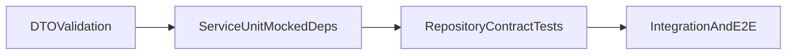

# Step 20 - Unit Testing di NestJS

## 1. Tujuan Belajar

Setelah step ini kamu diharapkan:

- Memahami beda **unit test** vs **integration/e2e test**.
- Bisa menulis unit test dengan pola **AAA** (Arrange, Act, Assert).
- Bisa mock dependency pada NestJS (`provider token`, service lain, repository).
- Bisa membuat unit test untuk **service**, **controller**, dan **guard**.
- Bisa menyusun test advanced untuk **authentication flow** (`login`, `refresh`, `lockout`).
- Bisa menguji batas **ValidationPipe/DTO validation** pada level yang tepat.
- Bisa menulis test async service yang deterministik (`rejects`, async mock interaction).
- Memahami strategi bertahap untuk **repository testing** (unit -> contract -> integration).
- Memahami praktik **data isolation** agar test stabil dan tidak saling bocor state.
- Bisa membaca hasil test, menjalankan coverage, dan menentukan target coverage realistis.

---

## 2. Konsep Dasar: Unit Test itu apa?

**Unit test** menguji satu unit logika kecil secara terisolasi (biasanya 1 class atau 1 method), tanpa bergantung ke network/database asli.

Di project ini:

- Unit test contoh ada di `src/app.controller.spec.ts`, `src/courses/courses.service.spec.ts`, dan `src/courses/courses.controller.spec.ts`.
- E2E test contoh ada di `test/app.e2e-spec.ts`.

Ringkas:

- **Unit test**: cepat, fokus logic local, dependency di-mock.
- **E2E**: lebih realistis (via HTTP), tetapi lebih lambat.

---

## 3. Tooling yang dipakai di project ini

Project sudah memakai **Jest** + **Nest TestingModule**.

Script utama (lihat `package.json`):

- `pnpm run test` → jalankan unit test.
- `pnpm run test:watch` → watch mode.
- `pnpm run test:cov` → coverage report.
- `pnpm run test:e2e` → e2e test.

### 3.1 Apa yang otomatis dibuat NestJS saat project dibuat?

Saat membuat project baru dengan Nest CLI (misalnya `nest new nama-project`), NestJS **sudah menyiapkan baseline testing** secara otomatis:

- dependency test utama (`jest`, `ts-jest`, `@types/jest`, `supertest`, `@nestjs/testing`),
- script test di `package.json` (`test`, `test:watch`, `test:cov`, `test:e2e`),
- contoh unit test awal (`src/app.controller.spec.ts`),
- contoh e2e test awal (`test/app.e2e-spec.ts`),
- config e2e (`test/jest-e2e.json`),
- config Jest utama (di project ini tersimpan di `package.json` bagian `jest`).

Artinya, untuk project Nest standar, kamu **tidak mulai dari nol** untuk setup testing.

### 3.2 Jadi apa yang tetap perlu kita buat sendiri?

Yang perlu ditambahkan developer/instruktur biasanya:

- file `*.spec.ts` baru untuk module yang diajarkan (auth, guard, DTO, middleware, dll),
- mock dependency sesuai arsitektur project (mis. `PrismaService`, `JwtService`, provider token repository),
- test matrix per fitur (success/failure/security edge cases),
- opsional: threshold coverage minimum untuk menjaga kualitas di CI.

Ringkasnya:

- **NestJS menyiapkan mesin testing-nya otomatis**,
- **kita yang menulis isi test sesuai business logic project**.

---

## 4. Pola Berpikir: Arrange - Act - Assert (AAA)

Setiap test sebaiknya dibaca seperti cerita:

1. **Arrange**: siapkan data + mock.
2. **Act**: panggil method yang diuji.
3. **Assert**: cek hasil dan interaksi.

Contoh sederhana:

```typescript
it('should return greeting message', () => {
  // Arrange
  const expected = 'Learning Platform API – NestJS';

  // Act
  const result = appController.getHello();

  // Assert
  expect(result).toBe(expected);
});
```

---

## 5. Anatomy Unit Test di NestJS

Untuk class NestJS, pattern umum:

1. Buat `TestingModule` dengan `Test.createTestingModule(...)`.
2. Daftarkan class yang diuji di `providers`/`controllers`.
3. Ganti dependency dengan mock (jika perlu).
4. `module.get(...)` untuk ambil instance.
5. Jalankan test case per method.

Contoh aktual dari project:

```typescript
const module: TestingModule = await Test.createTestingModule({
  controllers: [AppController],
  providers: [AppService],
}).compile();

appController = module.get<AppController>(AppController);
```

---

## 6. Unit Test Service (dengan mock dependency)

Target umum: test business logic service tanpa DB asli.

### 6.1 Kenapa mock?

Misalnya `AuthService` memakai `PrismaService`, `JwtService`, `ConfigService`. Kalau tidak di-mock, test jadi:

- lambat,
- rapuh,
- dan berubah jadi integration test.

### 6.2 Template pattern untuk service

```typescript
const prismaMock = {
  user: {
    findUnique: jest.fn(),
    update: jest.fn(),
  },
};

const jwtMock = {
  signAsync: jest.fn(),
  verifyAsync: jest.fn(),
};

const configMock = {
  get: jest.fn(),
  getOrThrow: jest.fn(),
};

const module = await Test.createTestingModule({
  providers: [
    AuthService,
    { provide: PrismaService, useValue: prismaMock },
    { provide: JwtService, useValue: jwtMock },
    { provide: ConfigService, useValue: configMock },
  ],
}).compile();
```

### 6.3 Skenario yang wajib dites (AuthService)

- `login()` sukses -> mengembalikan `access_token` + `refresh_token`.
- `validateUser()` gagal password -> `UnauthorizedException`.
- lockout aktif (`lockUntil` masih masa depan) -> `UnauthorizedException`.
- `refresh()` token valid -> token baru terbit.
- `refresh()` token invalid/expired -> `UnauthorizedException`.

---

## 7. Unit Test Controller (mock service)

Controller test fokus ke hal berikut:

- controller memanggil service method yang tepat,
- parameter diteruskan benar,
- return value dari service diteruskan.

Controller **tidak** menguji logic bisnis berat (itu domain service).

Template:

```typescript
const authServiceMock = {
  login: jest.fn(),
  refresh: jest.fn(),
};

const module = await Test.createTestingModule({
  controllers: [AuthController],
  providers: [{ provide: AuthService, useValue: authServiceMock }],
}).compile();
```

Skenario minimal:

- `AuthController.login()` memanggil `authService.login(dto)`.
- `AuthController.refresh()` memanggil `authService.refresh(dto)`.

---

## 8. Unit Test Guard (contoh `RolesGuard`)

Guard test biasanya butuh:

- mock `ExecutionContext`,
- mock `Reflector`,
- mock `request.user`.

Yang dites untuk `RolesGuard`:

- jika tidak ada metadata role -> `true`.
- jika role sesuai -> `true`.
- jika role tidak sesuai / user kosong -> throw `ForbiddenException`.

Template mock context:

```typescript
const contextMock = {
  getHandler: jest.fn(),
  getClass: jest.fn(),
  switchToHttp: () => ({
    getRequest: () => ({ user: { role: 'student' } }),
  }),
} as unknown as ExecutionContext;
```

---

## 9. Advanced Unit Testing untuk Authentication

Bagian ini fokus pada `AuthService` yang paling kaya branch security.

### 9.1 Test matrix `AuthService`

Minimal matrix yang disarankan:

- `login()` sukses -> return `access_token` + `refresh_token` + user summary.
- `validateUser()` email tidak ada -> `UnauthorizedException`.
- `validateUser()` password salah -> counter gagal login bertambah.
- `validateUser()` lockout aktif (`lockUntil > now`) -> `UnauthorizedException`.
- `refresh()` token valid -> token pair baru diterbitkan (rotation).
- `refresh()` token invalid/expired/type salah -> `UnauthorizedException`.
- `refresh()` hash mismatch -> deteksi reuse/invalid token.

### 9.2 Boundary test untuk auth policy berbasis env

Karena policy dibaca dari env (`AUTH_MAX_FAILED_LOGINS`, `AUTH_LOCK_MINUTES`), uji juga:

- threshold pas (`maxFailedLogins - 1` -> belum lock).
- threshold terlewati (`maxFailedLogins` -> lock aktif).
- nilai env tidak valid -> fallback default tetap aman.

### 9.3 Assert interaksi dependency mock

Untuk memastikan alur benar, jangan hanya assert output. Tambahkan assert call:

- `expect(prisma.user.update).toHaveBeenCalledWith(...)` untuk counter/lock.
- `expect(jwt.signAsync).toHaveBeenCalledTimes(...)` untuk access+refresh.
- `expect(jwt.verifyAsync).toHaveBeenCalledWith(refreshToken, ...)`.

---

## 10. Testing ValidationPipe (DTO & Pipeline Boundaries)

`ValidationPipe` punya dua level pengujian:

1. **DTO-level validation test** (unit-style): cepat, fokus rules `class-validator`.
2. **Pipeline/route-level test** (integration/e2e): memastikan request invalid benar-benar ditolak di endpoint.

### 10.1 Kapan DTO test saja cukup?

- Saat ingin memverifikasi rule murni (`@IsEmail`, `@MinLength`, dll).
- Saat ingin cepat menguji banyak kombinasi input invalid.

### 10.2 Kapan perlu route-level test?

- Saat ingin bukti bahwa `ValidationPipe` global aktif.
- Saat ingin memverifikasi format response error (`status`, `message`, wrapper app).

### 10.3 Contoh struktur test invalid payload

```typescript
it('should fail dto validation for invalid email', async () => {
  const dto = plainToInstance(LoginDto, {
    email: 'not-an-email',
    password: 'MentorDemo123',
  });
  const errors = await validate(dto);
  expect(errors.some((e) => e.property === 'email')).toBe(true);
});
```

Contoh pipeline-level (integration-style) untuk membuktikan `ValidationPipe` runtime:

```typescript
await request(app.getHttpServer())
  .post('/test-auth-validation/login')
  .send({ email: 'not-an-email', password: '123' })
  .expect(400);
```

Catatan pengajar:

- panggilan method controller langsung **tidak** memicu `ValidationPipe` global,
- validasi berbasis decorator DTO dijalankan oleh pipeline HTTP NestJS.

---

## 11. Async Service Test Patterns

Banyak method auth bersifat async. Gunakan pola assert async yang benar.

### 11.1 Pattern error assertion

```typescript
await expect(service.refresh(dto)).rejects.toThrow(UnauthorizedException);
```

Jangan pakai `toThrow` langsung tanpa `await expect(...).rejects`.

### 11.2 Deterministic async mock

- Selalu set hasil mock eksplisit (`mockResolvedValue`, `mockRejectedValue`).
- Hindari ketergantungan timer nyata atau network call.
- Jaga satu skenario satu sumber kegagalan agar debugging mudah.

### 11.3 Race-condition aware mindset

Untuk topik advanced, diskusikan:

- apa yang terjadi jika dua refresh request datang hampir bersamaan,
- bagaimana test memastikan behavior tetap konsisten (minimal melalui call-order/assertion).

---

## 12. Repository Testing (Phase-Later Strategy)

Agar kurikulum bertahap, pakai urutan ini:

1. **Unit-first**: service pakai repository mock.
2. **Contract test**: repository implementation diuji dengan contract yang sama.
3. **Integration DB test**: validasi query nyata ke DB test.

### 12.1 Contract matrix sederhana

Untuk tiap method repository, siapkan skenario:

- success (data ada, return shape benar),
- not-found (return `null` / throw sesuai contract),
- error propagation (DB error dipetakan dengan benar).

Dengan matrix ini, saat ganti implementasi repository (mis. InMemory -> Prisma), service test tetap stabil.

---

## 13. Data Isolation & Deterministic Test

Data isolation penting supaya hasil test tidak bergantung urutan eksekusi.

Praktik inti:

- reset mock tiap test: `beforeEach(() => jest.clearAllMocks())`.
- hindari shared mutable object antar test (gunakan factory function).
- jangan simpan state global yang diubah lintas test.
- jika test pakai module singleton, pertimbangkan recreate module per `beforeEach`.

Contoh factory pattern:

```typescript
const makeUser = (overrides?: Partial<any>) => ({
  id: 1,
  email: 'mentor@learning.local',
  role: 'admin',
  ...overrides,
});
```

---

## 14. Peta Level Testing (Roadmap)



Gunakan peta ini saat menjelaskan “test mana untuk masalah apa”.

---

## 15. Decision Table: Pilih Level Test yang Tepat

| Pertanyaan | Level test yang disarankan | Kenapa |
|---|---|---|
| Apakah rule DTO valid? | DTO unit-style (`class-validator`) | Cepat dan fokus ke rule |
| Apakah `ValidationPipe` global benar-benar jalan? | Integration/e2e (HTTP) | Pipe aktif di runtime request |
| Apakah business logic auth benar? | Service unit test + mock dependency | Isolasi branch logic security |
| Apakah controller forwarding benar? | Controller unit test | Verifikasi wiring call |
| Apakah role policy benar? | Guard unit test + 1 integration sanity test | Cek permission logic + real pipeline |

---

## 16. Resep Implementasi Cepat (template)

Gunakan resep ini untuk setiap fitur baru:

1. Tentukan method yang dites (1 method = 1 kelompok `describe`).
2. Buat test matrix minimal: success + error + edge case.
3. Siapkan mock dependency di `beforeEach`.
4. Jalankan AAA:
   - Arrange: data + mock return
   - Act: panggil method
   - Assert: hasil + interaction mock
5. Tambahkan 1 test integration jika butuh bukti pipeline runtime (`ValidationPipe`, guard chain, filter wrapper).

---

## 17. Struktur File Test yang direkomendasikan

Praktik yang enak diajar:

- Simpan test di file berdampingan: `*.spec.ts` di folder yang sama.
- Nama `describe` mengikuti nama class.
- Gunakan pola nested:
  - `describe('AuthService')`
  - `describe('login')`
  - `it('should ...')`

Contoh naming:

- `src/auth/auth.service.spec.ts`
- `src/auth/auth.controller.spec.ts`
- `src/auth/roles.guard.spec.ts`
- `src/auth/dto/login.dto.spec.ts` (opsional, jika ingin unit-style DTO validation test)

---

## 18. Coverage: cara baca dan target realistis

Jalankan:

```bash
pnpm run test:cov
```

Laporan coverage punya metrik:

- Statements
- Branches
- Functions
- Lines

Saran target pembelajaran:

- tahap awal: 60-70% di module yang diajarkan,
- naik bertahap ke 80% untuk area critical (`auth`, `billing`, dsb).

Jangan kejar angka semata; prioritaskan test pada:

- branch error,
- branch security (invalid token, forbidden role),
- branch edge case (expired token, lockout),
- dan branch async failure (dependency `reject`).

---

## 19. Common Mistakes (sering terjadi di kelas)

- Test terlalu bergantung DB/API asli -> lambat dan flaky.
- Hanya test happy path -> bug di branch error lolos.
- Assert terlalu umum (`toBeDefined`) -> kurang bermakna.
- Mock tidak di-reset antar test -> efek samping antar test case.
- Async assertion salah (lupa `rejects`) -> false positive.

Praktik bagus:

- `beforeEach(() => jest.clearAllMocks())`
- Assert panggilan mock: `toHaveBeenCalledWith(...)`
- Test message/exception yang penting untuk debugging.
- Pisahkan test unit vs integration sejak awal.

---

## 20. Alur Mengajar (saran 1 sesi 90-120 menit)

1. Buka `src/app.controller.spec.ts` -> jelaskan AAA.
2. Buka `src/courses/courses.service.spec.ts` -> jelaskan mock dependency.
3. Latihan mini: tambah test auth success/failure branch.
4. Latihan mini: test `RolesGuard` untuk allowed/forbidden.
5. Diskusikan batas DTO test vs route-level validation test.
6. Jalankan `pnpm run test` dan baca output bersama.
7. Jalankan `pnpm run test:cov` dan diskusi coverage serta gap branch security.

---

## 21. Checklist Penilaian

- [ ] Mahasiswa bisa menjelaskan beda unit vs e2e test.
- [ ] Mahasiswa bisa menulis test dengan pola AAA.
- [ ] Mahasiswa bisa mock dependency di `TestingModule`.
- [ ] Mahasiswa bisa menulis test auth service untuk success + failure + lockout branch.
- [ ] Mahasiswa bisa menulis assert interaksi mock (`prisma/jwt/config`) pada auth flow.
- [ ] Mahasiswa bisa menjelaskan beda DTO validation test vs pipeline/route-level test.
- [ ] Mahasiswa bisa menulis async error assertion dengan `await expect(...).rejects`.
- [ ] Mahasiswa bisa menjelaskan roadmap repository testing (unit -> contract -> integration).
- [ ] Mahasiswa bisa menerapkan data isolation (clear mocks, factory data, no shared mutable state).
- [ ] Mahasiswa bisa menjalankan `test`, `test:watch`, `test:cov` dan membaca coverage dasar.

---

## 22. Next Step (preview)

- Tambahkan coverage threshold minimum per area (`auth` lebih ketat dari module lain).
- Tambahkan contract test repository untuk memastikan perilaku konsisten lintas implementasi (`InMemory`, `Prisma`, dst).
- Tambahkan integration test auth chain lengkap: `login -> protected route -> refresh -> reuse old refresh token`.
- Tambahkan test negative path untuk middleware auth rate limit (429 + header assertion).
- Integrasikan report coverage ke CI agar regression cepat terdeteksi.
